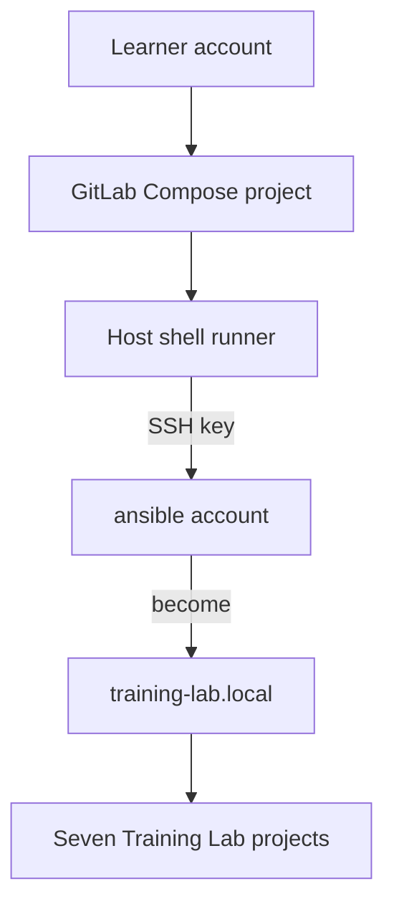
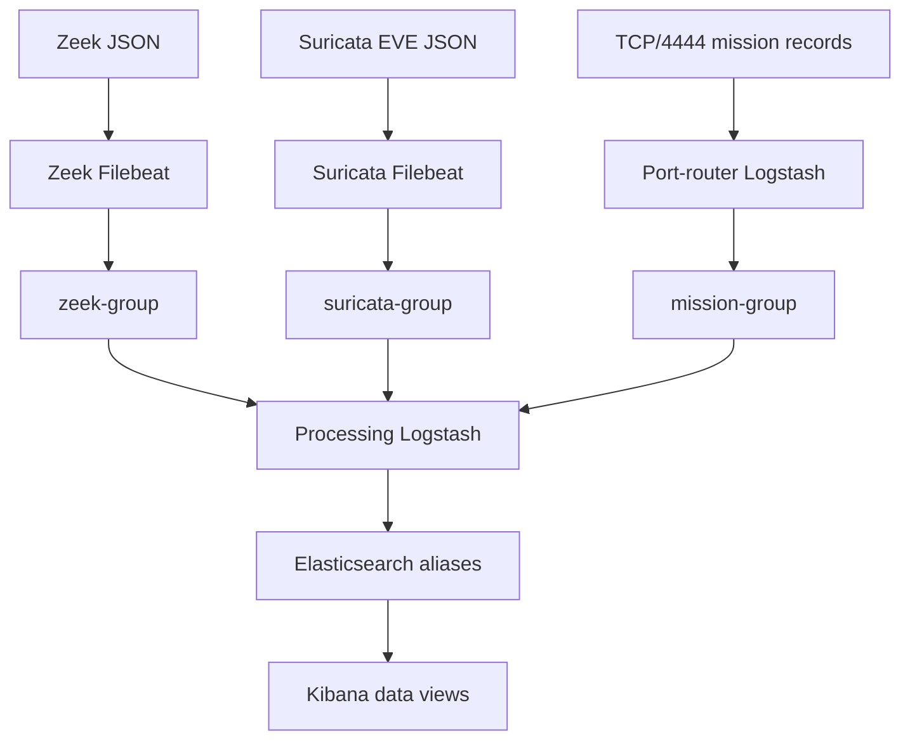

# Localhost reference architecture

## One host, several boundaries

The course removes VM administration without collapsing the concepts learners
need later. `training-lab.local` is one physical Linux host and one Ansible
inventory host. That host appears in six functional groups so the playbooks
still express service ownership.

GitLab is an eighth Compose project under `/var/training/gitlab`. It uses
bridge networking and loopback-only port publication. The seven data-stack
projects are rendered under `/var/docker` and use host networking. No role
owns GitLab or the Docker daemon.

The indirect runner-to-localhost SSH hop is intentional. It preserves the
inventory, key, known-host, remote-user, and privilege-escalation behavior of a
real controller/target relationship.

## Data paths

The Filebeat configurations use `filestream` plus newline-delimited JSON rather
than Elastic modules. That choice is explicit: module ingest pipelines are not
silently available when the event travels through Kafka. Zeek must therefore
emit JSON. Processing Logstash converts Zeek's numeric `ts` and Suricata's ISO
timestamp before writing their aliases.

The mission router parses before Kafka. It keeps the selected destination in
Logstash metadata, sends that destination as the Kafka `target_index` header,
and leaves parser identity visible in the JSON event. The consumer restores
the header under metadata and writes to the chosen alias. Elasticsearch output
has data streams, ILM, and automatic template management disabled so those
features cannot override the course's explicit alias contract.

Kafka uses broker append time for record retention. The JSON document still
retains the source event in `@timestamp`, but historical samples are not
discarded merely because their source dates are old.

## Local name resolution

Application names resolve to loopback on the host. A host-networked container
shares the network namespace, but Docker still gives it a private `/etc/hosts`.
Every Compose template therefore supplies the `.local` aliases through
`extra_hosts`; changing only the host file is insufficient for a running
container.

The host role owns one marked block in `/etc/hosts`. The learner must add the
initial `training-lab.local` entry manually so Ansible can make its first SSH
connection. After that first connection, the role adopts the complete alias
set without templating the whole operating-system file.

## Persistence and lifecycle

| Project | Persistent or host-owned state |
|---|---|
| GitLab | config, logs, and application data under `/var/training/gitlab` |
| Elasticsearch | `/var/docker/elasticsearch/data` |
| Kibana | `/var/docker/kibana/data` |
| Kafka | `/var/docker/kafka/data` |
| Zeek Filebeat | registry under `/var/docker/filebeat_zeek/data`; canonical stable root plus the canonical active target when it resolves outside that root |
| Suricata Filebeat | registry under `/var/docker/filebeat_suricata/data`; host logs under `/var/log/suricata` |
| Both Logstash projects | committed configuration; no course data volume |

Filebeat registry persistence prevents an ordinary collector recreation from
re-reading every sensor record. The Zeek role resolves `logs/current` rather
than assuming it resides beneath the apparent parent. It mounts the stable
root read-only and conditionally mounts an external canonical active target at
the same absolute path. Normal file rotation stays within that target. An
administrative change to the symlink or Zeek `SpoolDir` requires rerunning the
sensor role so the Compose model and Filebeat path are reconciled.

## Deployment ownership

The host-preparation role verifies Docker and Compose, manages the alias block,
sets `vm.max_map_count`, and creates `/var/docker`. Service roles own only their
project paths and lifecycle. Common included tasks implement repeated Compose
render/deploy and readiness behavior.

The full order is:

1. prepare the physical host once;
2. deploy Elasticsearch and its storage assets;
3. deploy Kafka and create missing topics;
4. deploy processing Logstash;
5. deploy the mission port router;
6. deploy Kibana and its data views; and
7. deploy both Filebeat collectors.

The dependency-aware CI pipeline applies the same order only to selected
owners and downstream consumers. A learner-authored pipeline may run the full
playbook on every authorized push and still meet the course goal.

## Security boundary

This is an isolated disposable lab. Application authentication and transport
encryption are deliberately deferred, but every no-authentication listener is
loopback-only. SSH host-key checking remains enabled. The runner does not join
the Docker group and does not receive unrestricted passwordless root; it uses
its own key to reach the `ansible` identity, then Ansible performs explicit
become tasks. That key plus the Vault-supplied become credential is still an
effective root path: permission to change protected deployable CI or Ansible
content must be treated as privileged access to the lab host.

Host sensor logs remain owned and labeled as host-service data. Their Filebeat
binds are read-only and do not request relabeling. When SELinux is active,
Docker confinement is a host prerequisite: Zeek Filebeat uses `container_t`,
while Suricata Filebeat uses the narrower log-reading
`container_logreader_t` domain so `/var/log/suricata` can retain its native
log label.
